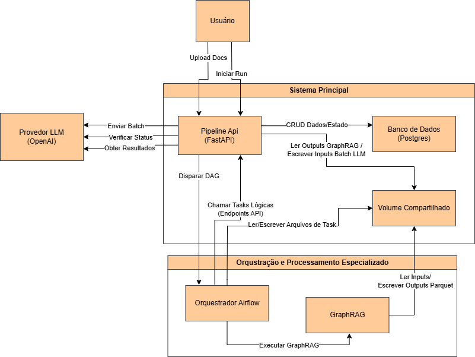

# TaxoGrafo: Geração Automatizada de Grafos de Conhecimento Educacional

Este repositório contém o software artefato desenvolvido para o Trabalho de Conclusão de Curso (TCC) em Ciência da Computação, intitulado **"Proposta de Construção de Grafos de Conhecimento Educacional com Modelos de Linguagem Orientados pela Taxonomia de Bloom"**.

> Para descrição detalhada da proposta, metodologia e resultados, por favor, consulte o documento completo do TCC, disponível neste repositório: [`documentos/TCC_II_André_Hoffmann.pdf`](./documentos/TCC_II_André_Hoffmann.pdf).

O objetivo deste projeto é fornecer um framework funcional para automatizar a criação de grafos de conhecimento a partir de fontes de texto não estruturadas. O sistema foi projetado para extrair conceitos, estruturá-los hierarquicamente e enriquecê-los com metadados pedagógicos.

Para fins de validação e replicação, os dados e artefatos da execução principal utilizada como pesquisa experimental no TCC (identificada como `run_id="tcc_run"`) estão incluídos. A seção "Guia de Replicação" detalha como carregar estes dados.

## Visão Geral do Sistema e Arquitetura

O core do projeto é uma pipeline de processamento de dados orquestrada pelo **Apache Airflow**. A pipeline executa uma série de tarefas para transformar um documento de texto em um grafo de conhecimento:

1.  **Ingestão e Estruturação Inicial:** O texto de entrada é processado pela ferramenta **GraphRAG** da Microsoft para extrair entidades (conceitos, pessoas, locais) e identificar comunidades temáticas, formando uma estrutura de grafo inicial.
2.  **Geração de Unidades de Conhecimento (UCs):** Para cada entidade ou comunidade identificada, o sistema utiliza um **Modelo de Linguagem (LLM)** para gerar um conjunto de UCs. Cada conjunto segue os seis níveis da **Taxonomia de Bloom Revisada**, criando uma trilha de aprendizado cognitivamente estruturada (de `Lembrar` a `Criar`).
3.  **Estimativa de Dificuldade:** Para mitigar o problema de "cold start" (atribuição de dificuldades iniciais quando ainda não há dados de desempenho de alunos) em sistemas adaptativos, o sistema submete as UCs a uma segunda etapa de avaliação pelo LLM, que estima a dificuldade relativa de cada tarefa, fornecendo um score inicial.
4.  **Construção do Grafo Final:** As UCs e suas estimativas de dificuldade são persistidas como nós. Relações de pré-requisito (`REQUIRES`) e de expansão temática (`EXPANDS`) são criadas para conectar os nós, formando o grafo de conhecimento final.

A arquitetura é baseada em serviços conteinerizados e gerenciados via **Docker Compose**:
-   **API Central (FastAPI):** Expõe endpoints para controlar as execuções da pipeline e consultar os dados gerados.
-   **Orquestrador (Apache Airflow):** Gerencia a execução das tarefas da pipeline de forma assíncrona.
-   **Banco de Dados (PostgreSQL):** Persiste todos os metadados, artefatos intermediários e o grafo final.
-   **Processador de Grafos (GraphRAG):** Serviço isolado para a análise de NLP.



## Estado Atual e Limitações

Este projeto é um **protótipo funcional (proof-of-concept)** desenvolvido no âmbito de um TCC. O foco principal foi a construção e validação da pipeline de backend para a geração dos dados.

-   **Endpoints de Consulta:** Foram desenvolvidos endpoint GET para consulta, no entanto alguns dos endpoints implementados, principalmente os mais complexos, o foram apenas de maneira inicial e podem apresentar inconsistências.

Siga os passos abaixo para configurar e executar o ambiente localmente.

### 1. Pré-requisitos
*   Git
*   Docker e Docker Compose

### 2. Configuração Inicial
1.  **Clone o repositório:** `git clone https://github.com/Andresho/TaxoGrafo.git` e entre na pasta `cd TaxoGrafo`.
2.  **Crie o arquivo de ambiente:** Copie o arquivo `.env.example` para `.env` com `cp .env.example .env`.
3.  **Edite o `.env`:** A única variável **obrigatória** para executar novas pipelines é a `OPENAI_API_KEY`. Para replicar a pesquisa experimental, não é necessário alterá-la. É recomendado ajustar o `AIRFLOW_UID` para o seu ID de usuário local (`id -u`) para evitar problemas de permissão.

### 3. Restaurando a Pesquisa Experimental do TCC
Este é o método recomendado para avaliar o projeto. Ele irá carregar os dados da execução `tcc_run` em seu ambiente.

1.  **Inicie os serviços:**
    ```bash
    docker-compose up --build -d
    ```
    Aguarde cerca de um minuto para que todos os serviços, especialmente o banco de dados, estejam totalmente operacionais.

2.  **Execute o script de restauração:**
    Este script irá copiar os artefatos do GraphRAG e mesclar os dados do TCC com o banco de dados (sem apagar dados de outras execuções que você possa ter).
    ```bash
    chmod +x restore_tcc_run.sh
    ./restore_tcc_run.sh
    ```

3.  **Explore os Resultados:**
    Com os dados restaurados, acesse a documentação interativa da API para explorar o grafo de conhecimento:
    -   **Swagger UI:** **[http://localhost:8000/docs](http://localhost:8000/docs)**
    -   Use os endpoints `GET` sob a tag **"Results"**, utilizando `tcc_run` como o `run_id`.

### 4. Executando uma Nova Pipeline
Para processar um novo documento:
1.  **Inicie os serviços:** `docker-compose up -d`.
2.  **Acesse a API:** `http://localhost:8000/docs`.
3.  Use o endpoint `POST /api/v1/resources/upload` para enviar seu arquivo PDF ou TXT e copie o `resource_id` retornado.
4.  Use o endpoint `POST /pipeline/{run_id}/init` para iniciar uma nova execução, fornecendo um `run_id` de sua escolha e o `resource_id` obtido.
5.  Acompanhe o progresso na interface do Airflow: `http://localhost:8080`.

## Licença

Este projeto está licenciado sob a Licença MIT. Veja o arquivo [`LICENSE.md`](./LICENSE.md) para mais detalhes.